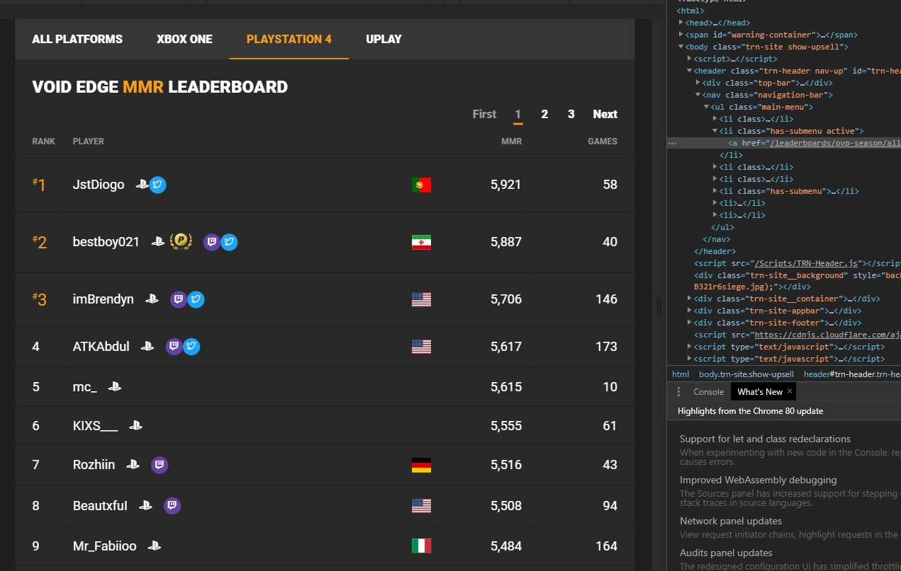
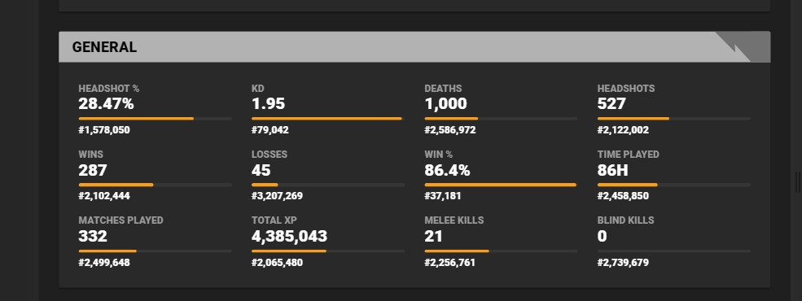

[](https://generalassemb.ly/education/web-development-immersive)
  
<h1 style = 'color:#f2d53c'> Project 3: Sharing Dataset on Kaggle </h1>
<a href = 'https://www.kaggle.com/fahadalqahtani/tom-clancys-rainbow-six-siege' > tom-clancys-rainbow-six-siege on kaggle </a>

<p> For this project I have selected a game Leaderboard website  that contains the stats  of over than  17 million player  (wins, time played….). the idea of selecting  this website is to see what is  the  important skills that top players  have in common . I am going to do Web-scrapeing on <a href ='https://r6.tracker.network/leaderboards/pvp-season/all/Mmr?region=-1&season=17'> R6Tracker website  </a>
</p>


<h1 style = 'color:#f2d53c' >Web Scraping </h1>
So first thing I am going to take 849 leaderboard page 

<a href = 'https://www.ubisoft.com/en-us/game/rainbow-six/siege'> 

</a>

#### getting leaderboards pages 
```python
from time import sleep
driver = webdriver.Chrome('chromedriver.exe')
driver.get('https://r6.tracker.network/leaderboards/pvp-season/psn/Mmr?region=-1&season=17')
for i in range(849):
    # create browser obj
    lst_.append(driver.page_source)
    # access search box 
    next_ = driver.find_element_by_link_text("Next")
    sleep(2)
    next_.click()
    sleep(2)
```

#### getting players stat
<a href = 'https://r6.tracker.network/profile/psn/JstDiogo'> 

</a>


```python

stats_pages  = []
try:
    for nm in all_names :
        for elm in [requests.get(f'https://r6.tracker.network/profile/psn/{nm}')]:
            stats_pages.append(elm.text)
except Exception as e :
    pass 
```
        
        
        
        
        
        
#### data  description  
---
|Feature|Type|Description|
|---|---|---|
|player_name|object|unique name for every player in playstion network|
|kills|int|The number of kills the player have | 
|deaths|int|The number of deaths the player have| 
|wins|int|The number of wins the player have| 
|losess|int|The number of losess the player have| 
|xp|float|The number of points the player earned |
|headshots|int|the number of kills in the head player did|
|melee|int|The number  melee killd|
|games_played|int|The Number of games player played|
|time_played|int|The amount of time spent |


---
